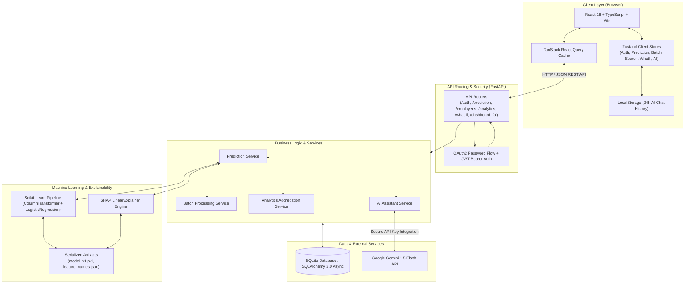

# AttritionIQ

Enterprise HR Intelligence and Employee Attrition Risk Prediction Platform

---

## 1. Project Overview

AttritionIQ is a full-stack, enterprise-grade HR intelligence platform designed to assess, explain, and mitigate voluntary employee turnover. By uniting supervised machine learning, local explainability through SHAP (SHapley Additive exPlanations), aggregated organizational workforce analytics, and conversational artificial intelligence powered by Google Gemini, AttritionIQ transforms raw human resources data into actionable, decision-support insights.

In modern organizations, voluntary employee attrition imposes substantial replacement costs, disrupts project continuity, and depletes organizational institutional knowledge. Traditional HR analytics models often report attrition retrospectively. AttritionIQ shifts the paradigm from reactive post-exit reporting to proactive, explainable risk management by identifying early attrition probability signals, isolating the key factors driving turnover risk, and providing simulations for targeted retention strategies.

---

## 2. Problem Statement

1. **Unpredictable Turnover Dynamics:** Employee departures frequently occur without advance notice, leaving HR leaders with insufficient time to implement retention interventions.
2. **The "Black Box" Barrier:** Standard machine learning classifiers output numeric probabilities without context. Without granular feature-level explanations, HR business partners cannot determine why an employee is flagged as high-risk.
3. **Dataset Heterogeneity in HR Workflows:** HR datasets originate from diverse HR Information Systems (HRIS), applicant trackers, and custom payroll exports with non-standard column headers and missing feature fields.
4. **Actionability Gap:** Identifying risk is insufficient without the ability to simulate hypothetical policy adjustments, such as modifying overtime allocations, adjusting compensation bands, or restructuring role expectations.
5. **Operational Privacy and Data Protection:** HR data contains sensitive employee identifiers and personal information, requiring responsible in-memory data processing, transparent reset procedures, and constrained AI guidance.

---

## 3. Objectives

- **Develop a Predictive Modeling Pipeline:** Build and train a supervised classification pipeline to calculate individual attrition probabilities based on 30 validated workplace, demographic, and compensation attributes.
- **Provide Explainable AI (XAI):** Integrate SHAP linear feature attribution to isolate specific risk elevators and protective factors for every prediction.
- **Support Flexible Batch Evaluation:** Enable CSV drag-and-drop ingestion with automated column compatibility analysis, robust schema mapping, and exportable predictions.
- **Deliver Scenario Sensitivity Simulations:** Implement a What-If simulation engine to compute real-time risk deltas ($\Delta p$) when modifying employee workplace variables.
- **Deliver Generative AI HR Guidance:** Integrate a bounded conversational AI assistant powered by Google Gemini to translate model findings into actionable HR retention plans while strictly adhering to ethical HR policies.
- **Provide Aggregated Workforce Analytics:** Present real-time departmental risk distributions, overtime impacts, and job-role turnover counts via an enterprise visualization suite.
- **Deliver Developer and User Convenience:** Provide one-click startup capabilities on Windows with automated path resolution and persistent service management.

---

## 4. Key Features

- **Individual Prediction Engine:** Instant single-employee scoring across 30 demographic, tenure, satisfaction, and compensation parameters.
- **Batch CSV Prediction:** Automated multi-record scoring with schema compatibility validation (`FULLY_COMPATIBLE`, `PARTIALLY_COMPATIBLE`, `INCOMPATIBLE`) and CSV export.
- **SHAP Feature Attribution:** Mathematically grounded identification of top risk-contributing factors and protective factors for each evaluated profile.
- **Employee Search & Profile Lookup:** Fast in-memory search by Employee ID across uploaded CSV files with linked prediction history.
- **Contact Intelligence:** Dynamic association of prediction risk tiers with employee contact fields (Name, Email, Phone, Address) with one-click clipboard copying and multi-tier filtering.
- **Interactive HR Analytics Dashboard:** Monochromatic, executive-grade charts for risk distributions, overtime comparisons, department breakdowns, and job-role metrics.
- **What-If Scenario Simulator:** Real-time side-by-side comparison of baseline vs. modified parameters with instantaneous risk delta calculation.
- **AI HR Assistant:** Context-aware LLM explanations powered by Gemini 1.5 Flash with prompt constraints prohibiting punitive or automated termination recommendations.
- **24-Hour AI Conversation History:** Browser-persisted, multi-session conversation management with automatic 24-hour TTL expiration.
- **Background Task Persistence:** Global topbar status indicator ensuring asynchronous tasks (batch processing, compatibility checks, simulations, AI streaming) persist across frontend route transitions.
- **Command-Center Dashboard:** Real-time KPI summaries, operational component health checks, and active background operation tracking.
- **Safe Demo Data Reset:** Controlled administrative endpoint to purge prediction records and restore genuine database empty states without modifying user accounts, authentication tokens, or ML models.
- **One-Click Windows Launcher:** Standalone batch script (`start_attritioniq.bat`) with automated environment verification, backend Uvicorn launch, frontend Vite launch, and browser startup.

---

## 5. Application Modules

### Dashboard Command Center
The central executive hub displaying real-time aggregated metrics:
- **Primary KPI StatCards:** Total Employees Analyzed, High Risk Count, Medium Risk Count, Low Risk Count, Average Attrition Probability, and Cumulative Predictions.
- **Active Operations Tracker:** Displays ongoing background operations with direct routing.
- **Risk Distribution & System Architecture:** Visual breakdown of workforce risk tiers alongside live runtime indicators for the ML Pipeline, SHAP Explainer, AI HR Assistant, and Relational Store.
- **Quick Action Grid:** Shortcut navigation across all platform capabilities.
- **System Controls:** Accessible modal interface to safely reset demo prediction data.

### Employee Search
Enables dataset-driven search and individual employee profile examination:
- **CSV Ingestion & Analysis:** Drag-and-drop upload with automatic row-count, column-count, and Employee ID column resolution.
- **Profile Card:** Formatted presentation of all employee attributes.
- **Stored Prediction History:** Displays historical attrition probability, risk tier, model version, execution timestamp, and SHAP feature drivers.
- **Employee Contact Information:** Dedicated card mapping available contact fields (Name, Email, Phone, Address) with fallback placeholders (`—`).

### Individual Prediction
A structured form interface for assessing single employee profiles:
- **Parameter Form:** Categorized into Demographics, Role & Work Environment, Compensation, Tenure & Career History, and Performance & Satisfaction.
- **Prediction Output Card:** Prominent probability score, functional risk badge, advisory disclaimer, top risk-contributing factors, top protective factors, and one-click export to What-If or the AI Assistant.

### Batch Prediction
Enables high-throughput multi-employee risk scoring:
- **Compatibility Analysis:** Evaluates uploaded CSV schemas against the 31-column model definition.
- **Execution:** Processes valid rows, fills missing features in partial datasets using pipeline imputers (`is_estimated=True`), and persists results.
- **Results Table:** Searchable, filterable table displaying scored rows, risk levels, and probabilities with CSV download support.

### Analytics
Aggregated organizational intelligence visualizations:
- **Overall Risk Tier Distribution:** Donut chart with centered total count, functional risk slices, and breakdown legend with exact counts and percentages.
- **Overtime Status Risk Comparison:** Dual-track comparative indicators showing mean attrition probabilities for overtime vs. non-overtime cohorts.
- **Departmental Risk Distribution:** Grouped bar chart comparing High, Medium, and Low risk distributions across departments.
- **Attrition Count by Job Role:** Horizontal stacked bar chart with expanded label boundaries for complete role name visibility.
- **Enterprise Chart Tooltips:** Unified, tabular tooltips displaying category headers, color-coded indicator dots, exact figures, and summary totals.

### AI HR Assistant
A contextual conversational interface:
- **Context Injection:** Injects employee details, risk tier, and top SHAP factor attributions directly into multi-turn chat sessions.
- **Prompt Safety Guardrails:** System prompts restrict the model to advisory guidance, preventing punitive suggestions and emphasizing constructive retention planning.
- **Session Sidebar:** Supports creating new threads, selecting past discussions, and deleting single or all threads.

### What-If Simulation
A comparative decision-support tool:
- **Side-by-Side Parameter Configuration:** Adjust compensation hikes, overtime requirements, stock options, job satisfaction, and work-life balance scores.
- **Simulation Delta:** Evaluates statistical responses and outputs Baseline Risk $\to$ Modified Scenario Risk $\to$ Estimated Risk Delta ($\Delta p$).

### Contact Intelligence
A risk-stratified workforce contact directory:
- **Synchronized Data Pipeline:** Links in-memory CSV rows with verified prediction records from Batch Prediction and Employee Search.
- **Segmented Risk Filtering:** Dedicated tabs for `ALL`, `HIGH RISK`, `MEDIUM RISK`, and `LOW RISK`.
- **Clipboard Productivity:** Quick-copy buttons for Email and Phone numbers with visual feedback.
- **Direct Search Linking:** Clicking an Employee ID transitions directly to Employee Search with the ID pre-populated.

---

## 6. Machine Learning Workflow

The supervised machine learning pipeline is structured as an end-to-end reproducible workflow:

```
[HR Dataset (CSV)]
       │
       ▼
[Data Validation & Preprocessing]
       │   ├── Drop Non-Informative Columns (EmployeeCount, Over18, StandardHours, EmployeeNumber)
       │   └── Target Mapping (Attrition: "Yes" -> 1, "No" -> 0)
       │
       ▼
[Scikit-Learn ColumnTransformer Pipeline]
       │   ├── Numerical Features (23): SimpleImputer(median) -> StandardScaler()
       │   └── Categorical Features (7): SimpleImputer(most_frequent) -> OneHotEncoder(ignore_unknown)
       │
       ▼
[Logistic Regression Classifier]
       │   ├── Class Weight: {0: 1, 1: 2}
       │   ├── Regularization: C=0.1
       │   └── Solver: lbfgs (max_iter=1000)
       │
       ▼
[Inference Output]
       │   ├── Probability Score (0.0 to 1.0)
       │   └── Configurable Risk Tier Mapping (<0.30: LOW, 0.30-0.60: MEDIUM, >=0.60: HIGH)
       │
       ▼
[SHAP Linear Attribution Engine]
       │   ├── Feature Contribution Calculation: coef_i * transformed_feature_i
       │   └── Factor Ranking (Top Risk Elevators vs. Top Protective Factors)
       │
       ▼
[Decision Support Layer]
           ├── Dashboard Aggregations
           ├── Batch & Individual Reports
           ├── What-If Sensitivity Engine
           └── Generative AI Explanations
```

### Verified Model Performance Metrics

From hold-out test set evaluation ($N = 294$, 20% stratified test set):

| Metric | Cross-Validation Score (5-Fold Mean $\pm$ Std) | Hold-Out Test Set Score ($N=294$) |
|---|---|---|
| **ROC-AUC** | $0.8359 \pm 0.0307$ | $0.8140$ |
| **PR-AUC (Avg. Precision)** | $0.6466 \pm 0.0560$ | $0.5984$ |
| **F1-Score** | $0.6098 \pm 0.0426$ | $0.5301$ |
| **Precision** | $0.6446 \pm 0.0412$ | $0.6111$ |
| **Recall** | $0.5842 \pm 0.0714$ | $0.4681$ |

**Test Set Confusion Matrix:**
$$\begin{bmatrix} \text{TN}=233 & \text{FP}=14 \\ \text{FN}=25 & \text{TP}=22 \end{bmatrix}$$

---

## 7. Explainable AI (XAI) Implementation

AttritionIQ utilizes linear SHAP formulations implemented in `AttritionExplainer`:

- **Mathematical Formulation:** For a linear pipeline, the marginal contribution $\phi_i$ of preprocessed feature $x_i$ is computed as:
  $$\phi_i = w_i \cdot x_i$$
  where $w_i$ represents the trained model coefficient for that feature column.
- **Baseline Value:** The intercept $\beta_0$ represents the base log-odds of employee attrition.
- **Attribution Categories:**
  - **Risk Elevators ($\phi_i > 0$):** Attributes that increase attrition probability (e.g., frequent overtime, lower job involvement, long distance from home).
  - **Protective Factors ($\phi_i < 0$):** Attributes that decrease attrition probability (e.g., higher monthly income, high job satisfaction, higher stock option level).
- **Human-Readable Resolution:** Column-transformer prefixes (e.g., `num__`, `cat__`) and one-hot suffixes are dynamically mapped back to clean business labels (e.g., `Overtime: Yes`, `Job Role: Research Scientist`).

---

## 8. System Architecture



---

## 9. Technology Stack

| Layer | Component | Version / Library | Purpose |
|---|---|---|---|
| **Frontend** | Core Framework | React `18.3.1` | Component-driven user interface |
| | Language | TypeScript `5.4.5` | Static type safety |
| | Build Tool | Vite `5.3.1` | Local development server and production bundler |
| | State Management | Zustand `4.5.2` | Client-side reactive stores |
| | Data Fetching | TanStack React Query `5.45.1` | Server state caching and invalidation |
| | Form Handling | React Hook Form `7.52.0` + Zod `3.23.8` | Schema validation and input handling |
| | Styling | Tailwind CSS `3.4.4` | Utility-first design tokens and responsive layouts |
| | Data Visualization | Recharts `2.12.7` | SVG-based responsive analytics charts |
| | Icons | Lucide React `0.395.0` | Enterprise iconography |
| **Backend** | API Framework | FastAPI `0.111.0` | High-performance asynchronous REST API |
| | Server | Uvicorn `0.29.0` | ASGI production application server |
| | Serialization | Pydantic `2.7.1` | Data validation, parsing, and settings management |
| | Authentication | Python-JOSE `3.3.0` + Passlib `1.7.4` | JWT creation/verification and bcrypt password hashing |
| **ML & Data** | Machine Learning | Scikit-Learn `1.4.2` | Pipeline construction, preprocessing, and classification |
| | Explainability | SHAP `0.46.0` | Feature-level attribution calculations |
| | Data Analysis | Pandas `2.2.2` + NumPy `1.26.4` | Tabular data manipulation and matrix operations |
| | Model Serialization | Joblib `1.4.2` | Pipeline persistence to disk |
| **AI Integration** | Generative AI | Google Generative AI SDK `0.7.2` | Gemini 1.5 Flash conversational integration |
| **Database** | ORM | SQLAlchemy `2.0.30` | Asynchronous relational schema management |
| | Storage Engine | SQLite 3 (`aiosqlite` `0.20.0`) | Embedded relational database |
| **Testing** | Test Suite | Pytest `8.2.0` + Pytest-Asyncio `0.23.6` | Automated API and ML unit testing |

---

## 10. Project Structure

```
Employee_Prediction/
├── README.md                           # Comprehensive technical documentation
├── docker-compose.yml                  # Multi-container orchestration definition
├── start_attritioniq.bat               # Windows one-click launcher script
│
├── backend/                            # FastAPI Python Backend
│   ├── .env                            # Local environment configuration (git-ignored)
│   ├── .env.example                    # Template environment variables
│   ├── .gitignore                      # Backend ignore rules
│   ├── Dockerfile                      # Backend container definition
│   ├── pytest.ini                      # Test configuration
│   ├── requirements.txt                # Python package dependencies
│   ├── attrition.db                    # SQLite database file (git-ignored)
│   │
│   ├── app/                            # Backend Application Package
│   │   ├── main.py                     # FastAPI application factory and router registration
│   │   ├── ai/
│   │   │   └── assistant.py            # Gemini integration and prompt guardrails
│   │   ├── api/                        # REST API Router Endpoints
│   │   │   ├── ai.py                   # /ai endpoints
│   │   │   ├── analytics.py            # /analytics endpoints
│   │   │   ├── auth.py                 # /auth endpoints (register, login, onboarding)
│   │   │   ├── dashboard.py            # /dashboard summary & demo reset endpoints
│   │   │   ├── employees.py            # /employees profile & search endpoints
│   │   │   ├── prediction.py           # /prediction individual & batch endpoints
│   │   │   └── whatif.py               # /what-if simulation endpoints
│   │   ├── auth/                       # Security & Session Infrastructure
│   │   │   ├── dependencies.py         # JWT bearer extraction and user verification
│   │   │   └── security.py             # Password hashing and token generation
│   │   ├── database/                   # Persistence Layer
│   │   │   ├── base.py                 # SQLAlchemy DeclarativeBase
│   │   │   └── session.py              # Async engine and sessionmaker
│   │   ├── ml/                         # Machine Learning Infrastructure
│   │   │   ├── explainer.py            # SHAP LinearExplainer implementation
│   │   │   ├── predictor.py            # Singleton predictor inference service
│   │   │   ├── train.py                # Pipeline training, validation, and serialization script
│   │   │   └── artifacts/              # Generated ML Artifacts
│   │   │       ├── feature_names.json  # 30-feature schema definition
│   │   │       ├── model_v1.pkl        # Serialized Scikit-Learn pipeline
│   │   │       └── training_metrics.json # Stored CV and test set evaluation scores
│   │   ├── models/                     # SQLAlchemy Database Entities
│   │   │   ├── employee.py             # Employee master entity
│   │   │   ├── organization.py         # Organization tenant entity
│   │   │   ├── prediction.py           # Prediction result entity
│   │   │   ├── prediction_explanation.py # SHAP attribution entity
│   │   │   └── user.py                 # User account entity
│   │   ├── schemas/                    # Pydantic Request/Response Models
│   │   │   ├── auth.py
│   │   │   ├── chat.py
│   │   │   ├── employee.py
│   │   │   ├── prediction.py
│   │   │   └── whatif.py
│   │   ├── services/                   # Business Logic Layer
│   │   │   ├── analytics_service.py
│   │   │   ├── batch_service.py
│   │   │   └── prediction_service.py
│   │   └── utils/                      # Helper Utilities
│   │       ├── config.py               # Pydantic BaseSettings management
│   │       ├── dataset_compatibility.py # CSV column matcher and validation logic
│   │       └── feature_mapping.py      # Column alias normalization
│   │
│   ├── data/                           # Training Dataset Storage
│   │   └── WA_Fn-UseC_-HR-Employee-Attrition.csv # IBM HR dataset
│   └── tests/                          # Automated Pytest Suite
│       ├── test_api.py                 # API route validation tests
│       └── test_ml.py                  # Model inference and explainer tests
│
└── frontend/                           # React 18 TypeScript Frontend
    ├── package.json                    # Node.js dependencies and scripts
    ├── package-lock.json               # Locked dependency tree
    ├── tsconfig.json                   # TypeScript compiler configuration
    ├── tsconfig.node.json
    ├── vite.config.ts                  # Vite build settings & backend reverse proxy
    ├── tailwind.config.js              # Design token configurations
    ├── postcss.config.js
    ├── nginx.conf                      # Production Nginx reverse proxy configuration
    ├── Dockerfile                      # Frontend container definition
    │
    └── src/                            # Frontend Application Source
        ├── App.tsx                     # Top-level route configuration
        ├── main.tsx                    # React DOM root mounting
        ├── index.css                   # Global Tailwind styles & utility classes
        ├── components/                 # Reusable Enterprise UI Components
        │   ├── BackNavigation.tsx      # Global back button
        │   ├── EnterpriseChartTooltip.tsx # Unified analytics chart tooltip
        │   ├── LoadingSpinner.tsx      # Accessible loading spinner
        │   ├── RiskBadge.tsx           # Functional risk badge (High/Med/Low)
        │   ├── Sidebar.tsx             # Enterprise navigation drawer
        │   ├── StatCard.tsx            # KPI metric presentation card
        │   └── Topbar.tsx              # Header with background operations indicator
        ├── layouts/                    # Application Layout Shells
        │   ├── AppLayout.tsx           # Authenticated layout with Sidebar & Topbar
        │   └── AuthLayout.tsx          # Minimal authentication layout
        ├── pages/                      # Application Route Views
        │   ├── AiAssistantPage.tsx
        │   ├── AnalyticsPage.tsx
        │   ├── BatchPage.tsx
        │   ├── ContactPage.tsx
        │   ├── DashboardPage.tsx
        │   ├── EmployeeSearchPage.tsx
        │   ├── ForgotPasswordPage.tsx
        │   ├── LandingPage.tsx
        │   ├── LoginPage.tsx
        │   ├── OnboardingPage.tsx
        │   ├── PredictionPage.tsx
        │   ├── SignupPage.tsx
        │   └── WhatIfPage.tsx
        ├── services/                   # Axios API Client Connectors
        │   ├── aiService.ts
        │   ├── analyticsService.ts
        │   ├── api.ts                  # Base Axios instance with Bearer interceptors
        │   ├── authService.ts
        │   ├── employeeService.ts
        │   ├── predictionService.ts
        │   └── whatIfService.ts
        ├── store/                      # Zustand Reactive State Stores
        │   ├── aiStore.ts
        │   ├── authStore.ts
        │   ├── batchStore.ts
        │   ├── employeeSearchStore.ts
        │   ├── predictionStore.ts
        │   └── whatIfStore.ts
        ├── types/                      # TypeScript Interface Definitions
        │   └── index.ts
        └── utils/                      # Helper Functions
            ├── cn.ts                   # Classname merge helper
            └── formatters.ts           # Number, date, and percentage formatters
```

---

## 11. Installation & Setup

### Prerequisites
- **Python:** Version 3.10, 3.11, or 3.12 installed and added to `PATH`
- **Node.js & npm:** Node.js (v18+ recommended) and `npm` installed and added to `PATH`
- **Git:** Installed for version control

---

### Option A: One-Click Windows Startup (Recommended)

Double-click the launcher script in the project root:
```cmd
start_attritioniq.bat
```
This launcher performs automated environment validation, starts the backend Uvicorn server in a dedicated terminal, starts the frontend Vite server in a separate terminal, and opens your default browser at `http://localhost:3000`.

---

### Option B: Manual Setup

#### Step 1: Backend Setup
Open a terminal in the `backend/` directory:
```bash
cd backend

# 1. Create and activate a Python virtual environment
python -m venv venv

# Windows (Command Prompt / PowerShell):
.\venv\Scripts\activate
# Linux / macOS:
source venv/bin/activate

# 2. Install backend dependencies
pip install -r requirements.txt

# 3. Configure environment variables
# Copy template if .env does not exist:
copy .env.example .env

# 4. Train the ML model pipeline (generates model_v1.pkl and metrics)
python -m app.ml.train

# 5. Start the FastAPI development server (runs on port 8000)
python -m uvicorn app.main:app --reload --port 8000
```
Backend API documentation will be available at: `http://localhost:8000/docs`

#### Step 2: Frontend Setup
Open a second terminal in the `frontend/` directory:
```bash
cd frontend

# 1. Install Node.js dependencies
npm install

# 2. Start the Vite development server (runs on port 3000)
npm run dev
```
Access the application web interface at: `http://localhost:3000`

---

## 12. Environment Variables & Configuration

Backend settings are managed via Pydantic Settings in `backend/.env`. Template available in `backend/.env.example`:

| Variable | Type | Default / Example Value | Description |
|---|---|---|---|
| `APP_NAME` | String | `"Employee Attrition Risk Intelligence System"` | Application title |
| `DEBUG` | Boolean | `false` | Enables verbose debug logging |
| `SECRET_KEY` | String | *(Random secret string)* | HMAC-SHA256 signing key for JWT tokens |
| `ACCESS_TOKEN_EXPIRE_MINUTES` | Integer | `120` | JWT token expiration lifespan |
| `DATABASE_URL` | String | `sqlite+aiosqlite:///./attrition.db` | Async database connection string |
| `MODEL_VERSION` | String | `v1` | Active model identifier tag |
| `MODEL_ARTIFACT_PATH` | String | `app/ml/artifacts/model_v1.pkl` | Path to serialized Scikit-Learn pipeline |
| `FEATURE_NAMES_PATH` | String | `app/ml/artifacts/feature_names.json` | Path to feature schema definition |
| `LOW_THRESHOLD` | Float | `0.30` | Risk boundary below which risk is classified as LOW |
| `HIGH_THRESHOLD` | Float | `0.60` | Risk boundary at/above which risk is classified as HIGH |
| `GEMINI_API_KEY` | String | *(Your Google Gemini API Key)* | API key for generative AI features |
| `GEMINI_MODEL` | String | `gemini-1.5-flash` | Selected Gemini model tag |
| `ALLOWED_ORIGINS` | String | `http://localhost:3000,http://127.0.0.1:3000` | Comma-separated CORS allowed origins |

*Security Notice: Never commit actual secret keys or `.env` files to source control repositories.*

---

## 13. End-to-End User Workflow

```
[1. User Authentication]
     ├── User registers organization and account at /signup
     └── Logs in at /login -> Receives JWT token -> Navigates to /dashboard
            │
            ▼
[2. Executive Overview (Dashboard)]
     ├── Reviews high-level organizational KPIs (Analyzed count, Risk breakdowns)
     └── Monitors active system components and background tasks
            │
            ▼
[3. Dataset Ingestion & Profile Search (Employee Search)]
     ├── Uploads HR dataset CSV -> Inspects automated schema compatibility
     ├── Enters Employee ID -> Retrieves employee profile and stored prediction
     └── Inspects separate Employee Contact Information
            │
            ▼
[4. Predictive Scoring (Individual / Batch)]
     ├── Option A: Scores individual employee at /prediction -> Views SHAP factors
     └── Option B: Uploads workforce CSV at /batch -> Scores cohort -> Exports results
            │
            ▼
[5. Strategic Retention & Sensitivity (What-If & AI Assistant)]
     ├── Simulates compensation/overtime adjustments at /what-if -> Observes Risk Delta
     └── Consults AI Assistant at /ai-assistant for plain-language retention plans
            │
            ▼
[6. Workforce Contact & Action (Contact Intelligence)]
     ├── Filters workforce by HIGH / MEDIUM / LOW risk tiers at /contact
     └── Copies contact details (Email / Phone) to initiate retention outreach
```

---

## 14. Data Security & Privacy Considerations

- **Stateless Client Data Handling:** In-memory CSV parsing in Employee Search and Contact Intelligence processes files directly within the browser runtime, avoiding unnecessary persistence of raw employee spreadsheets.
- **Client-Side Credential Isolation:** The Google Gemini API key resides solely within backend environment variables; raw keys are never transmitted to client browsers.
- **Cryptographic Token Lifecycle:** User passwords are encrypted with salted bcrypt hashing. Sessions use standard Bearer JWT authentication verified per request via FastAPI dependencies.
- **Controlled Demo Purging:** The administrative Demo Data Reset endpoint selectively deletes prediction records, explanation rows, and generated employee snapshots without dropping tables, truncating user accounts, or modifying ML model files.
- **Automated AI History TTL:** Conversational histories stored in browser `localStorage` automatically expire and are purged after 24 hours.

---

## 15. Testing & Verification

The project includes both automated pytest verification suites and structured end-to-end integration workflows:

### Automated Test Suite (`backend/tests/`)
- **`test_ml.py`:** Validates model pipeline loading, probability scoring boundaries ($0.0 \le p \le 1.0$), risk tier thresholding, and SHAP feature attribution generation.
- **`test_api.py`:** Tests FastAPI routing, health check endpoints, schema validations, and mock prediction queries.

Execute backend automated tests:
```bash
cd backend
pytest
```

### Manual Functional Verification Checklist
- [x] **Authentication Flow:** User registration, password validation, JWT token issuance, and route protection.
- [x] **Individual Prediction:** Form validation across 30 features, real-time inference, and SHAP factor attribution.
- [x] **Batch Prediction:** Dropzone ingestion, compatibility reporting, and CSV prediction export.
- [x] **Employee Search:** Header normalization, in-memory search, and profile rendering.
- [x] **Contact Intelligence:** Dynamic risk level synchronization, tier filtering, and clipboard copy feedback.
- [x] **What-If Simulation:** Dual-parameter evaluation and risk delta calculation.
- [x] **Analytics Charts:** Recharts visualization rendering, custom enterprise tooltips, and dynamic legends.
- [x] **AI Assistant:** Multi-turn conversation streaming, context injection, and 24-hour expiration.
- [x] **Demo Data Reset:** Clean prediction deletion, cache invalidation, and UI metric restoration.

---

## 16. Interface Gallery

<!-- TODO: Add actual project interface captures to docs/screenshots/ prior to final presentation -->

- **Dashboard Command Center:** `docs/screenshots/dashboard.png`
- **Employee Search & Profile:** `docs/screenshots/employee-search.png`
- **Individual Prediction & SHAP:** `docs/screenshots/individual-prediction.png`
- **Batch CSV Scoring:** `docs/screenshots/batch-prediction.png`
- **Workforce Analytics:** `docs/screenshots/analytics.png`
- **Conversational AI Assistant:** `docs/screenshots/ai-assistant.png`
- **Contact Intelligence:** `docs/screenshots/contact.png`

---

## 17. Limitations

- **Database Architecture:** Uses an embedded SQLite database suitable for development, demonstrations, and single-server deployments; high-concurrency enterprise environments require PostgreSQL.
- **Local AI History:** AI conversation history is stored within browser `localStorage` with a 24-hour TTL rather than synchronized across multiple devices via database tables.
- **Dataset Contact Dependency:** Contact Intelligence derives contact attributes (Name, Email, Phone, Address) strictly from uploaded CSV headers; missing columns display `—` without synthetic enrichment.
- **Model Training Dataset:** Model parameters are trained on the IBM HR Analytics benchmark dataset ($N=1,470$); specialized organizational deployments require domain-specific model fine-tuning.

---

## 18. Future Scope

- **Integration with Enterprise HRIS:** Direct API connectors for Workday, BambooHR, and SAP SuccessFactors.
- **Advanced Ensemble Modeling:** Exploration of XGBoost, LightGBM, and CatBoost classifiers with automated hyperparameter tuning.
- **Role-Based Access Control (RBAC):** Tiered organizational roles (e.g., HR Business Partner, Department Manager, Executive Leader).
- **Time-Series Survival Modeling:** Incorporating Cox Proportional Hazards models to estimate time-to-attrition horizons.
- **Automated Retention Workflow Triggers:** Automated email notifications and HR task creation for high-risk employee segments.

---

## 19. Internship Project Information

- **Project Title:** AttritionIQ — Enterprise HR Intelligence & Employee Attrition Risk Prediction Platform
- **Domain:** Artificial Intelligence / Machine Learning / Full-Stack Development / HR Analytics
- **Developer:** Chinmay Meshram
- **Institution:** JSPM's Rajarshi Shahu College of Engineering, Pune
- **Academic Program:** Computer Science and Business Systems (CSBS)
- **Internship Organization:** Naviotech Solution Pvt. Ltd.

---

## 20. Conclusion

AttritionIQ demonstrates the practical convergence of supervised machine learning, explainable AI, modern full-stack web architecture, and generative language models in human resources analytics. By prioritizing explainability, flexible data handling, scenario simulations, and enterprise usability, the platform bridges the gap between predictive data science and actionable, responsible organizational workforce management.
